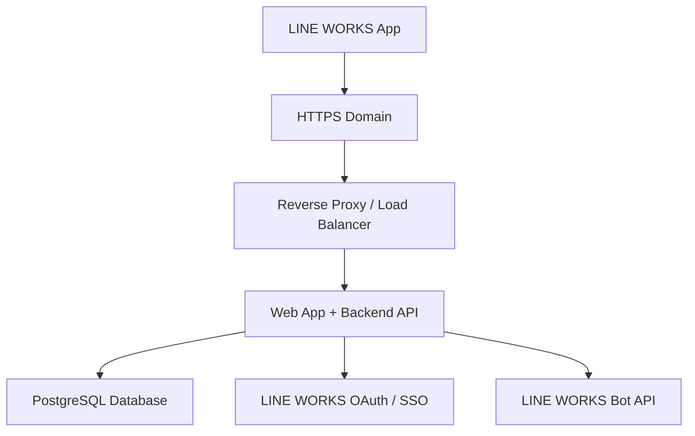

# 雲端主機部署規劃

## 部署目標

會議室預約系統正式版將部署在雲端主機，並提供 HTTPS 網址讓 LINE WORKS App 透過內建瀏覽器開啟使用。

## 建議架構

## 建議技術選型

### 第一版正式系統

- Runtime：Node.js
- Backend：Express 或 Fastify
- Database：PostgreSQL
- Auth：Cookie Session
- Password：scrypt / bcrypt 雜湊
- Frontend：沿用目前 HTML/CSS/JS，改為呼叫 API
- Deploy：Docker
- HTTPS：雲端平台代管憑證，或 Nginx + Let's Encrypt

### LINE WORKS 整合

- Web App：用 HTTPS URL 放入 LINE WORKS 入口
- SSO：串 LINE WORKS OAuth / SSO
- Bot：用 LINE WORKS Bot API 發送預約通知

## 雲端平台選項

### Render / Railway / Fly.io

優點：

- 部署快
- 內建 HTTPS
- 可快速建立 PostgreSQL
- 適合第一版正式系統

注意：

- 免費或低價方案可能會休眠
- 資料庫備份策略要另外確認

### Azure / AWS / GCP

優點：

- 正式營運穩定
- 權限、網路、安全性可控
- 適合公司長期使用

注意：

- 設定比較多
- 成本與維運責任較高

### 一般 VPS

優點：

- 成本可控
- 可完整掌控 Nginx、Docker、資料庫

注意：

- 需要自己處理 SSL、備份、安全更新

## 建議部署環境

### Production

- `APP_BASE_URL=https://booking.your-company.com`
- PostgreSQL managed database
- HTTPS only
- Secure cookie session
- LINE WORKS SSO enabled
- LINE WORKS Bot notification enabled for both booking user and admin channel

### Staging

- `APP_BASE_URL=https://booking-staging.your-company.com`
- 測試用 database
- 測試用 LINE WORKS Bot 或測試頻道

## Docker 化目標

正式版應至少包含：

- `Dockerfile`
- `docker-compose.yml`
- `.env.example`
- database migration
- seed admin command
- health check endpoint：`GET /api/health`

## 正式版部署步驟

1. 建立雲端主機或雲端 App Service
2. 建立 PostgreSQL database
3. 設定正式網域與 HTTPS
4. 設定 `.env`
5. 執行 database migration
6. 建立第一位系統管理員
7. 部署 Web App + Backend API
8. 到 LINE WORKS Developer Console 設定入口、SSO、Bot
9. 測試手機版 LINE WORKS 內建瀏覽器
10. 測試預約人通知、管理群組通知與後台權限

## 備份與營運建議

- PostgreSQL 每日自動備份
- 至少保留 7 到 30 天備份
- 系統管理操作寫入 audit log
- 預約建立、取消、會議室異動都留紀錄
- 後端錯誤記錄要能查詢
- 正式系統不要在前端保存密碼或權限規則

## 下一步

建議先建立正式後端骨架：

- `/api/auth`
- `/api/rooms`
- `/api/bookings`
- `/api/reports`
- `/api/users`
- `/api/line-works`

再把目前前端從 localStorage 改成呼叫 API。
