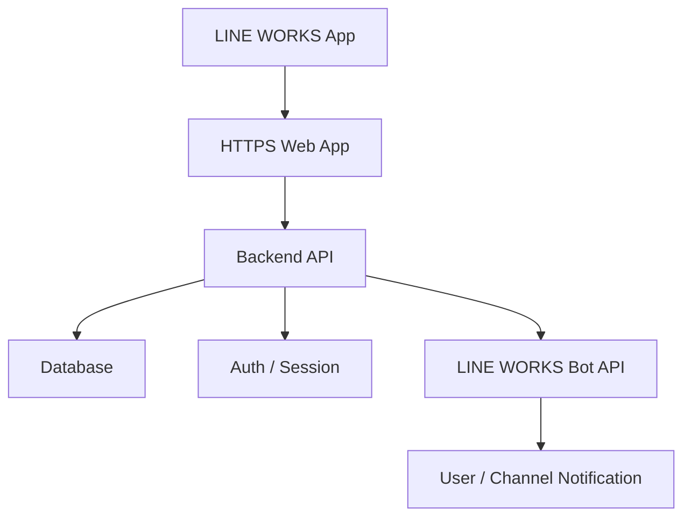

# 會議室預約系統正式化與 LINE WORKS 導入規劃

## 目標

將目前的前端原型升級為正式系統，讓公司成員可以在 LINE WORKS 內開啟使用，管理者可在後台管理會議室、帳號、權限與報表。

## 建議導入方式

1. 以 HTTPS 網站形式部署系統
   - LINE WORKS App 內會用內建瀏覽器開啟 Web 頁面。
   - 官方 SSO 文件也說明 LINE WORKS App / Drive Explorer 會透過內建瀏覽器呼叫客戶的 Web Login Page，因此本系統維持響應式 Web App 是正確方向。

2. LINE WORKS 登入整合
   - 正式版不再使用 localStorage 儲存帳密。
   - 改用後端 Session + LINE WORKS OAuth / SSO。
   - 若第一階段先不串 SSO，也應至少使用後端帳號、密碼雜湊與 Cookie Session。

3. LINE WORKS Bot 通知
   - 建立預約成功後，Bot 可推送訊息給預約人或管理群組。
   - 取消預約、會議室異動、每日摘要也可透過 Bot 發送。
   - 官方 Bot API 支援發送訊息給使用者與頻道，scope 需要 `bot.message`、`bot` 或 `bot.read`，依實際功能選擇。

## 正式系統架構

## 模組拆分

### 前台預約

- 查看日 / 週 / 月會議室使用狀態
- 建立預約
- 取消自己的預約
- 避免同會議室時段衝突

### 後台管理

- LINE WORKS / 後端登入
- 角色權限控管
- 會議室新增、編輯、停用、刪除
- 帳號與角色管理
- 報表總覽與圖表

### 通知

- 預約成功通知
- 取消預約通知
- 每日會議室使用摘要
- 管理者異常提醒，例如重複預約嘗試、停用會議室仍有人使用等

## 權限角色

| 角色 | 報表 | 會議室管理 | 帳號管理 | 系統設定 |
|---|---:|---:|---:|---:|
| 系統管理員 | 是 | 是 | 是 | 是 |
| 管理者 | 是 | 是 | 否 | 否 |
| 檢視者 | 是 | 否 | 否 | 否 |
| 一般使用者 | 否 | 否 | 否 | 否 |

## 資料表建議

### users

- id
- lineWorksUserId
- username
- displayName
- email
- passwordHash
- role
- status
- createdAt
- updatedAt

### rooms

- id
- name
- capacity
- equipment
- status
- createdAt
- updatedAt

### bookings

- id
- roomId
- userId
- hostName
- subject
- date
- startTime
- endTime
- attendees
- note
- status
- createdAt
- updatedAt

### audit_logs

- id
- actorUserId
- action
- targetType
- targetId
- payload
- createdAt

## LINE WORKS Developer Console 需要準備

1. 可公開存取的正式網址
   - 必須使用 HTTPS。
   - LINE WORKS SSO 文件提到基礎設施安全政策只允許 80 或 443 port。

2. OAuth / SSO App
   - Client ID
   - Client Secret
   - Redirect URI
   - Application Login URL

3. Bot App
   - Bot ID
   - Bot Secret
   - Service Account
   - Private Key
   - OAuth Scopes：至少 `bot.message`，若要管理 Bot 再加 `bot`

## 實作階段建議

### Phase 1：正式後端化

- 建立後端 API
- 將 localStorage 資料改為資料庫
- 密碼改用雜湊
- Cookie Session 登入
- 保留目前前端介面

### Phase 2：LINE WORKS 嵌入

- 部署到 HTTPS 網域
- 在 LINE WORKS 中設定入口連結
- 手機 App 內建瀏覽器測試

### Phase 3：LINE WORKS SSO 與 Bot

- 串 OAuth / SSO 登入
- 串 Bot API 通知
- 將 LINE WORKS 使用者 ID 綁定本系統帳號

### Phase 4：正式營運能力

- 稽核紀錄
- 備份
- 管理者操作記錄
- 錯誤監控
- 權限審查

## 下一步需要你提供

- 部署位置：雲端主機
- 登入方式：串 LINE WORKS SSO
- Bot 通知對象：預約人與管理群組都通知
- LINE WORKS 是否已有 Developer Console 管理權限
- 正式網址或預計網域
